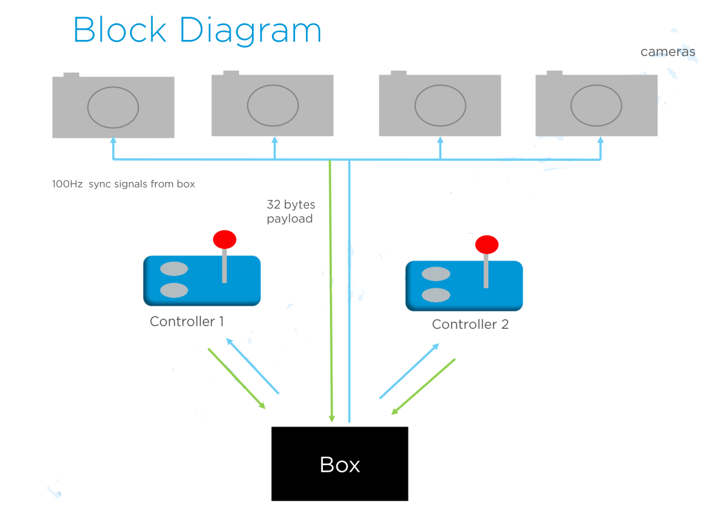

## Design Objectives
* Support up to 6 devices in total
* Data frame rate of 200Hz plus and a stretch goal of 300Hz
* Maximum resilience in the RF connection under the trace-off of system complexity
* Co-existence of up to 6 sets of same system

## Topology

## RF Pipelines
* BOX (Host)
	* logical address 0: TX to all the devices
	* logical address 1: RX for device 1
	* logical address 2: RX for device 2
	* logical address 3: RX for device 3
	* logical address 4: RX for device 4
	* logical address 5: RX for device 5

* Device
	* logical address 0: RX for the BOX
	* logical address 1: TX for the BOX

## A Two Mode Design
> **Setup mode** and **Normal mode**

## Setup Mode
* In Nordic 2.4GHz proprietary protocol, the 2.4Ghz frequency spectrun is divided into 80 1-MHz channels. The channels are grouped into bands depending on the number of channels in the frequency hopping table, e.g.5
* Upon entering the setup mode, the BOX would enter the channel picking phase
	* BOX would scan the spectrum and pick a 'reasonably good' channel from each of the bands to form the frequency hopping table, e.g. 5 channes from 5 bands

* The BOX would then switching to the pairing phase
	* The BOX would listen to pairing requests from the devices on a fixed set of pairing channes
	* Assumed that there is only ONE device sending pairing request
	* The BOX may accept the pairing request and respond to the paired device.
	* Information, such as address and data transmission latency, would be included in the response
* Devices receiving the pairing response will store the configuration information in its non-volatile memory

* Upon exiting the Setup Mode, the information will be stored in the BOX until cleared explicitly

* When Devices powers on, it sends pairing request to the BOX on one of the pairing channels. The BOX allocates time slot to the Device according to its type with and sends pairing response message to Device

* The BOX will not accept the pairing if the Device type exceeds the number that it can serve.

* If a new or replacement Device needed to be added to the system, the setup mode needed to be run all over to pair all the devices.
	* It is assumed that adding or replacing a new Device is a rare event and so the hassle for user can barely be justified

NOTE:
> ==The frequency carrier inside the hopping table may collide with WiFi channels and hence will have packet lost when operating on these channels.==

## Normal Mode Scheme 1
### Higher frame rate without retry
* 4ms frame interval -> 250Hz report rate
* One frame of data per interval, no retry on frame loss
* Frequency hopping per frame according to a fixed frequency hopping table
* The frequency hopping table is recommended to contain up to 5 frequencies. It can be bigger with overhead on inital synchronization between Devices with the BOX during power up setup
* Frequency can be picked to avoid overlapping with the WiFi channels
* Multiple sets of hopping tables can be defined to facilitate co-existence of multiple stes of Devices/BOX

## Normal Mode Scheme 2
### High frame rate with retries
* 9.9ms frame interval -> ~100Hz report rate
* Three interval per frame, 2 retries supported on data loss per frame
* Frequency hopping per interval according to a fixed frequency hopping table
* The frequency hopping table contains 3 fixed frequencies.
* Frequency can be picked to avoid overlapping with the WiFi channels
* Multiple sets of hopping tables can be defined to facilitate co-existence of multiple sets of Devices/BOXs

## How's it operate
* BOX sends out beacon packets per 10ms (100Hz) for 3 times at three different pre-defined frequencies
	* Beacon packet contains one byte to indicate which devices need to response 32 Bytes payload to the BOX
	* At the 1st beacon, the BOX requests all the devices to response
	* At eh 2nd beacon, the BOX requests those device(s) that fai response during 1st trial to send. At the last beacon, the BOX requests those device(s) still fail on the 2nd trial to send.
	
* Before getting sync with the BOX, the devices scan for the beacons from the box by turn on the receiving on particular channels with window length longer than a frame (e.g 12ms). Each device responds to the BOX at different delay units (about 250us per unit) after receiving beacon from the BOX

* As a result, there're three trials for each device to response payloads to the BOX

* Devices use different addresses to send payload back to the BOX to avoid cross talk

## How Devices Are Synchronized
* If there's request for devices to take actions simultaneously
	* The box sends out request to the Device at radio channe 1. All the Devices should take action if there's no interference.
	* However, if one or more devices cannot receive beacons at radio channel 1, the BOX will request those devicesto take action on channel 2. Those devices will have around 3.3ms lag.
	* Furthermore, if request from channel 2 still fail, the BOX will send the same request on radio channel 3 that results a further 3.3ms lag.

## On Interference Avoidance
* With WiFi
	* The 5 frequencies are picked from each of the 5 groups so that it won't collide with the WiFi channels assuming that not all 5 WiFi bands are occupied
	* The 5 frequencies can be picked from the 'gaps' to avoid WiFi channels as much as possible
	
* With Bluetooth
	* TX power not overwhelmingly higher than Nordic proprietary protocol
	* Bluetooth itself hops around 40 channels which collision with the 5 frequencies is not high by itself

* Among 6 identival systems
	* BOX would scan the channel in the channel picking phase and try its best to pick the best channels for normal operation
	* Without overlapping, identical systems won't interfere with each other
		